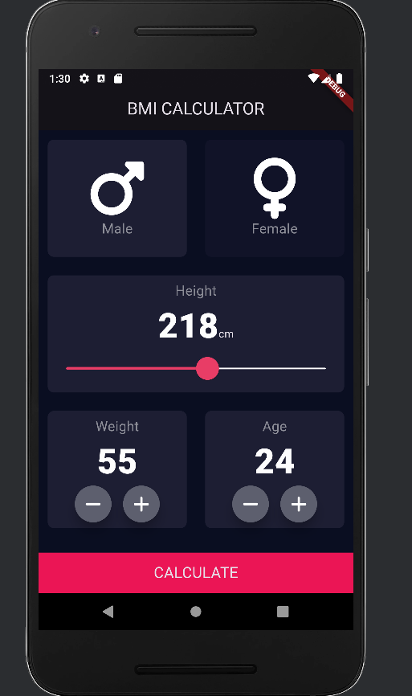
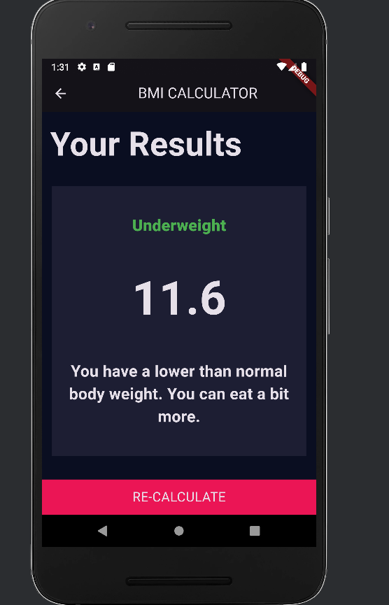

# BMI Calculator (Flutter)

A simple and efficient BMI (Body Mass Index) calculator built using Flutter. The app consists of two main screens: an **Input Screen** for gathering user data and a **Result Screen** to display the calculated BMI value and its corresponding category.

## Features

- **Two-screen navigation**:
    - **Input Screen**: Users input their weight, height, and other necessary parameters.
    - **Result Screen**: Displays the calculated BMI and provides information about the user's health status based on the BMI value.

- **Efficient styling**:
    - All styles (colors, text styles, paddings, etc.) are saved in constants to ensure better performance and maintainability.

- **Custom Widgets**:
    - The app contains various custom widgets, each with specific properties to enhance the reusability and modularity of the code.

- **Clean folder structure**:
    - The project follows a clear folder structure, separating components and screens to keep the codebase clean and organized. This makes the project easy to maintain and scale.
## Screenshots


## Folder Structure

```plaintext
lib/
│
├── components/          # Custom widgets and reusable components
│   ├── custom_button.dart
│   └── custom_text_field.dart
│
├── screens/             # Screen-specific UI and logic
│   ├── input_screen.dart
│   └── result_screen.dart
│
├── constants.dart       # Styling constants (colors, text styles, etc.)
└── main.dart            # Entry point of the app

## Installation

1. **Clone the repository**:
   ```bash
   git clone https://github.com/your-username/bmi-calculator.git

2. **Navigate to the project directory**:
   ```bash
   cd bmi-calculator
   
3. **Install dependencies**:
   ```bash
   flutter pub get
 
4. **Run the app**:
   ```bash
   flutter run

## Code Structure

### Constants

All styling constants (such as colors, text styles, and sizes) are defined in a separate file (`constants.dart`). This approach keeps the code clean and improves performance by reducing redundant style definitions across the app.

### Custom Widgets

The project uses a variety of custom widgets to keep the code modular and reusable. Each custom widget is well-documented, making it easy to modify or reuse them in different parts of the app.

#### Example of a Custom Widget:

```dart
class Roundediconbutton extends StatelessWidget {
  const Roundediconbutton(
      {super.key, required this.buttonIcon, required this.onPressed});

  final Icon buttonIcon;
  final void Function() onPressed;

  @override
  Widget build(BuildContext context) {
    return RawMaterialButton(
      onPressed: onPressed,
      elevation: 12.0,
      constraints: BoxConstraints.tightFor(
        width: 48,
        height: 48,
      ),
      child: buttonIcon,
      fillColor: Color(0xff5d5f6e),
      shape: RoundedRectangleBorder(
        borderRadius: BorderRadius.circular(24),
      ),
    );
  }
}


## How the App Works

1. **Input Screen**:
   - Users input their height and weight.
   - A button is provided to calculate the BMI based on the entered data.

2. **Result Screen**:
   - After calculation, the BMI value is displayed.
   - A message is shown indicating the user's health status based on their BMI (e.g., underweight, normal weight, overweight).

## License

This project is licensed under the MIT License. See the [LICENSE](LICENSE) file for details.

### MIT License


